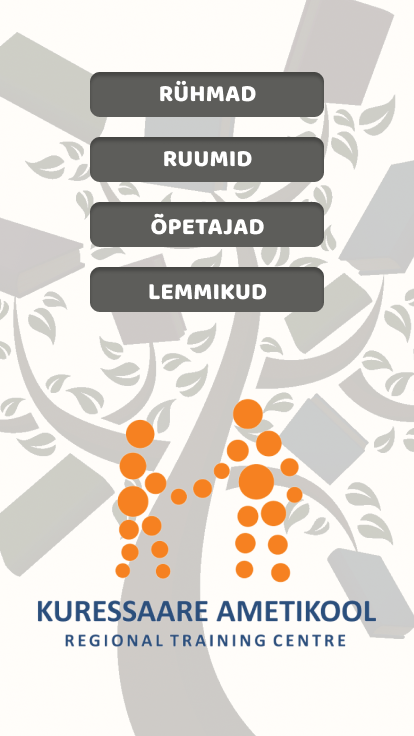

#    Portfolio
#   1. Projekt

##  Mida me tegime oma tiimiga?


```python
"Oma tiimiga me üritasime teha uut kujundust ametikooli tunniplaanile, et see oleks kasutajasõbralik ja õpetajatel oleks seda lihtsam kasutada"
````
##  Mis oli minu roll tiimis?
```python
"Minu roll tiimis oli leida hea kujundus ja sobivad värvid ja õppida vanemate õpilaste pealt kuidas käib koodi kirjutamine"
````
##  Viited(lingid)  projektile
```python
"Kõike siia ei jaga. Lihtsalt nalja pärast :D"
````




-   Esimene
-   Teine
-   Kolmas

*   Uus rida
*   veel


Siin on **bold** _text_ ja selle ~~tõmbame~~ maha

*_See text on italic ja bold_*

[Siin on link](https://www.google.com)

Siia ma kirjutan koodi


```python
"Hello, World!"
````


>   Kas Eestimaa on tõesti nii ilus

>   Hoiame loodust!

```python
"Tere tulemast"
`````

```python
"Kaunist päeva teile kõigile"
`````
[Järgmine link](https://www.youtube.com/watch?v=2O975ewRT7Q)

Lihtsalt tore päev
